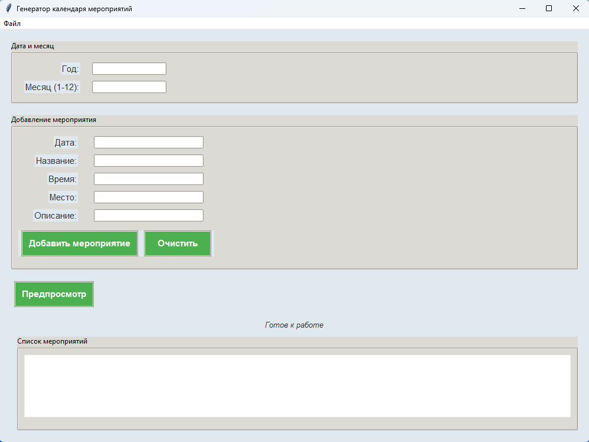
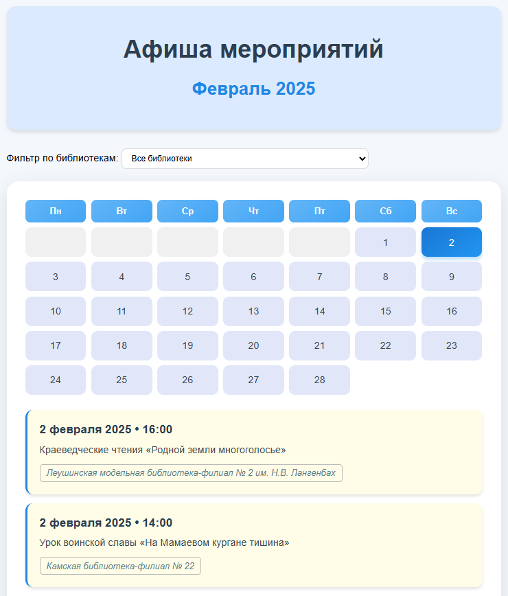

# Генератор календаря мероприятий


**Генератор календаря мероприятий** — это удобное приложение на Python с использованием `Tkinter` для создания интерактивных HTML-календарей с мероприятиями. Пользователи могут добавлять, редактировать и удалять события, настраивать дизайн и генерировать готовые HTML-файлы с возможностью предпросмотра. Приложение собрано в автономный исполняемый файл `.exe` для удобного использования на Windows.





## Версия программы

- **Текущая версия**: v1.0.0
- **Дата выпуска**: 14 марта 2025
- **Описание**: Первая стабильная версия с базовыми функциями: добавление, редактирование и генерация календарей.

## Скачать .exe

Вы можете скачать последнюю версию программы в формате `.exe` для Windows:
- [CalendarGenerator_v1.0.0.exe](https://github.com/bakan-off/CalendarGenerator/releases/download/v1.0.0/CalendarGenerator_v1.0.0.exe)

**Примечание**: Перед запуском убедитесь, что ваш антивирус не блокирует файл. Добавьте его в исключения, если требуется.

## Основные функции

- **Добавление мероприятий**: Укажите дату, название, время, место и описание события.
- **Редактирование и удаление**: Легко изменяйте или удаляйте добавленные мероприятия через интерфейс.
- **Сохранение проектов**: Сохраняйте свои календари в формате JSON для дальнейшей работы.
- **Генерация HTML-календаря**: Создавайте красивые HTML-календари с возможностью предпросмотра.
- **Настройка дизайна**: Персонализируйте цвета и текст через встроенные настройки.

## Установка (для разработчиков)

Если вы хотите запустить программу из исходного кода:

1. **Склонируйте репозиторий**:
   ```bash
   git clone https://github.com/bakan-off/CalendarGenerator.git
   cd CalendarGenerator
   
2. **Установите зависимости**: Убедитесь, что у вас установлен Python 3.8 или выше, и установите необходимые библиотеки:
   ```bash
   pip install jinja2
   
Примечание: Tkinter обычно включён в стандартную библиотеку Python. Если его нет (например, на некоторых Linux-системах), установите вручную:
      
      sudo apt-get install python3-tk  # Для Ubuntu/Debian
3. **Запустите приложение**:
   ```bash
   python calendar_app.py
   
